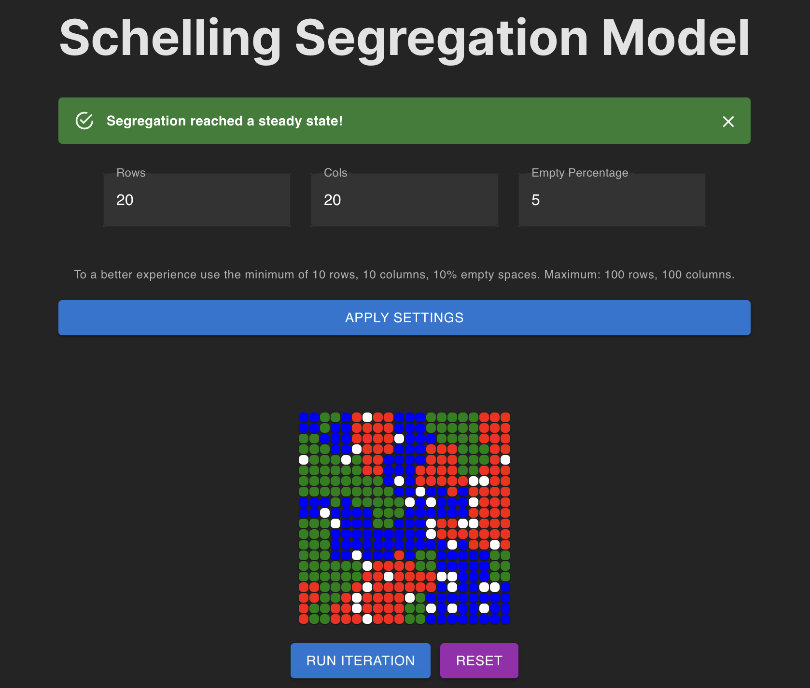

# Schelling Segregation Model Simulation

This project is a simulation of the Schelling Segregation Model, implemented using React and Material-UI. The model illustrates how individual preferences can lead to social segregation, even when those preferences are relatively mild.

## Overview

In this simulation, you can configure the size of the grid (number of rows and columns) and the percentage of empty spaces. Once configured, the simulation runs to determine if individuals are satisfied with their neighbors. If not, they move to a new location, and the process repeats until a steady state is reached.

## Features

- Adjustable grid size (rows and columns).
- Configurable percentage of empty spaces.
- Interactive simulation that visually shows how individuals move to achieve satisfaction.
- Validation to ensure valid settings (minimum 10 rows, 10 columns, 10% empty spaces; maximum 100 rows and 100 columns).

## How to Use

1. Clone the repository and install the dependencies.
2. Run the development server to view the simulation in your browser.
3. Adjust the settings (rows, columns, empty percentage) and click "Apply Settings" to configure the grid.
4. Click "Run Iteration" to start the simulation and watch as the individuals move to achieve satisfaction.

## License

This project is licensed under the MIT License.
